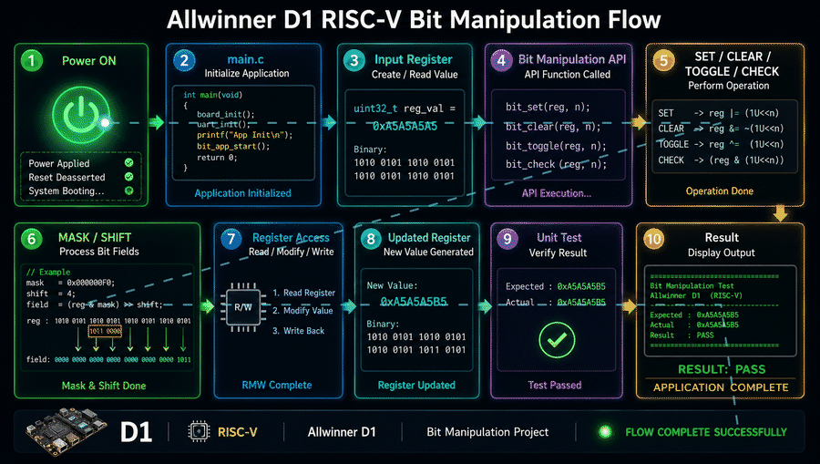

# Allwinner D1 RISC-V Processor — Bit Manipulation & Register Access

A structured **Embedded C / RISC-V programming project** focused on bit manipulation, register-level programming, bit-field operations, and software testing using the **Allwinner D1 RISC-V processor**.

The project is designed to demonstrate how low-level embedded software works with processor registers using operations such as **SET, CLEAR, TOGGLE, CHECK, MASK, SHIFT, and FIELD manipulation**.

---

## Complete Allwinner D1 System Flow

The following animation illustrates the complete Allwinner D1 RISC-V execution flow, from power-on and boot stages through the Linux kernel, device drivers, C/C++ application, and hardware peripherals.

<p align="center">
  
</p>

## Table of Contents

* [1. Project Overview](#1-project-overview)
* [2. Objectives](#2-objectives)
* [3. Hardware Platform](#3-hardware-platform)
* [4. Key Concepts](#4-key-concepts)
* [5. Project Architecture](#5-project-architecture)
* [6. Repository Structure](#6-repository-structure)
* [7. Software Flow](#7-software-flow)
* [8. Bit Manipulation Operations](#8-bit-manipulation-operations)
* [9. Register Access](#9-register-access)
* [10. Bit Field Operations](#10-bit-field-operations)
* [11. Examples](#11-examples)
* [12. Unit Testing](#12-unit-testing)
* [13. Build System](#13-build-system)
* [14. Build and Run](#14-build-and-run)
* [15. Debug Build](#15-debug-build)
* [16. Cleaning the Project](#16-cleaning-the-project)
* [17. Cross Compilation](#17-cross-compilation)
* [18. Hardware Register Integration](#18-hardware-register-integration)
* [19. Embedded Software Concepts Demonstrated](#19-embedded-software-concepts-demonstrated)
* [20. Future Enhancements](#20-future-enhancements)
* [21. Testing Strategy](#21-testing-strategy)
* [22. Learning Outcomes](#22-learning-outcomes)
* [23. Author](#23-author)

---

# 1. Project Overview

This project demonstrates **low-level Embedded C programming concepts on the Allwinner D1 RISC-V processor**.

The primary focus is understanding how software manipulates individual bits and groups of bits inside processor and peripheral registers.

The project implements reusable APIs for:

* Set bit
* Clear bit
* Toggle bit
* Check bit
* Set multiple bits
* Clear multiple bits
* Toggle multiple bits
* Check bit masks
* Extract register fields
* Modify register fields
* 32-bit operations
* 64-bit operations
* Register read/write
* Read-modify-write operations
* Binary register visualization

The software is organized into separate layers for **application logic, bit operations, register access, examples, tests, scripts, and documentation**.

---

# 2. Objectives

The main objectives of this project are:

1. Understand bit-level programming in Embedded C.
2. Implement reusable bit manipulation APIs.
3. Understand processor register programming.
4. Implement register read/write operations.
5. Understand `volatile` access for hardware registers.
6. Implement read-modify-write operations.
7. Understand bit masks and field extraction.
8. Implement 32-bit and 64-bit operations.
9. Develop reusable embedded software modules.
10. Build automated unit tests using assertions.
11. Understand embedded project organization.
12. Prepare the codebase for future Allwinner D1 peripheral integration.

---

# 3. Hardware Platform

## Processor

**Allwinner D1 RISC-V Processor**

The Allwinner D1 is a RISC-V based application processor suitable for Linux and embedded software development.

This project uses the D1 as the target processor architecture while initially keeping the bit-manipulation framework hardware-independent.

### Important

The project does **not** assume that arbitrary addresses are valid Allwinner D1 hardware registers.

Actual peripheral register addresses should be added only after verification against:

* Allwinner D1 documentation
* Board documentation
* Device Tree
* Linux kernel headers
* BSP source
* SoC technical documentation

This prevents accidental access to incorrect physical addresses.

---

# 4. Key Concepts

The project covers the following low-level concepts:

```text
Bit
 │
 ├── SET
 ├── CLEAR
 ├── TOGGLE
 └── CHECK
       │
       ▼
     Mask
       │
       ▼
    Bit Field
       │
       ▼
 Hardware Register
       │
       ▼
 Read / Modify / Write
```

---

# 5. Project Architecture

```text
                         Application
                             │
                             ▼
                         main.c
                             │
                ┌────────────┴────────────┐
                │                         │
                ▼                         ▼
       Bit Operations API          Register Access API
                │                         │
                ▼                         ▼
       bit_operations.c          register_access.c
                │                         │
                └────────────┬────────────┘
                             ▼
                     d1_registers.h
                             │
              ┌──────────────┼──────────────┐
              ▼              ▼              ▼
             SET           CLEAR          TOGGLE
              │              │              │
              └──────────────┼──────────────┘
                             ▼
                     MASK / FIELD / SHIFT
                             │
                             ▼
                     Register Operations
                             │
                             ▼
                  Allwinner D1 RISC-V
```

---

# 6. Repository Structure

```text
Allwinner_D1_RISC-V_Processor/
│
├── README.md
├── Makefile
│
├── include/
│   └── d1_registers.h
│
├── src/
│   ├── main.c
│   ├── bit_operations.c
│   ├── bit_operations.h
│   ├── register_access.c
│   └── register_access.h
│
├── examples/
│   ├── bit_mask_example.c
│   ├── set_bit_example.c
│   ├── clear_bit_example.c
│   ├── toggle_bit_example.c
│   ├── check_bit_example.c
│   └── shift_operation_example.c
│
├── tests/
│   ├── test_check_bit.c
│   ├── test_clear_bit.c
│   ├── test_set_bit.c
│   └── test_toggle_bit.c
│
├── scripts/
│   ├── build.sh
│   ├── clean.sh
│   └── run.sh
│
└── docs/
    ├── architecture.md
    ├── hardware.md
    ├── software_flow.md
    └── testing.md
```

---

# 7. Software Flow

The overall software execution flow is:

```text
                    Start
                      │
                      ▼
                 main.c
                      │
                      ▼
              Initialize Value
                      │
                      ▼
              Bit Manipulation API
                      │
        ┌─────────────┼─────────────┐
        ▼             ▼             ▼
       SET          CLEAR         TOGGLE
        │             │             │
        └─────────────┼─────────────┘
                      ▼
                    CHECK
                      │
                      ▼
                    MASK
                      │
                      ▼
                   FIELD
                      │
                      ▼
                Register Access
                      │
                      ▼
                  Test Result
                      │
                      ▼
                     End
```

---

# 8. Bit Manipulation Operations

## 8.1 Set Bit

Setting a bit changes it to `1` while preserving the other bits.

Conceptually:

```c
value |= (1U << bit);
```

Example:

```text
Before:

0000 0000

Set bit 3:

0000 1000
```

API:

```c
bit_set_u32(&value, 3);
```

---

## 8.2 Clear Bit

Clearing a bit changes it to `0`.

```c
value &= ~(1U << bit);
```

Example:

```text
Before:

1111 1111

Clear bit 3:

1111 0111
```

API:

```c
bit_clear_u32(&value, 3);
```

---

## 8.3 Toggle Bit

Toggle changes:

```text
0 → 1
1 → 0
```

Implementation:

```c
value ^= (1U << bit);
```

API:

```c
bit_toggle_u32(&value, 3);
```

---

## 8.4 Check Bit

A bit can be tested using:

```c
value & (1U << bit);
```

API:

```c
bool result;

bit_check_u32(value, 3, &result);
```

---

# 9. Register Access

The project provides an abstraction for register-level operations.

## Read Register

```c
uint32_t value = register_read32(address);
```

## Write Register

```c
register_write32(address, value);
```

## Set Register Bits

```c
register_set_bits32(address, mask);
```

## Clear Register Bits

```c
register_clear_bits32(address, mask);
```

## Toggle Register Bits

```c
register_toggle_bits32(address, mask);
```

## Read-Modify-Write

```c
register_update_bits32(address,
                       mask,
                       value);
```

The read-modify-write operation is particularly important for embedded software because a peripheral register may contain multiple independent control fields.

---

# 10. Bit Field Operations

Real hardware registers usually contain multiple fields.

Example:

```text
31                    8 7       5 4       2 1     0
+----------------------+---------+---------+-------+
|       Reserved       |  SPEED  |  MODE   | ENABLE|
+----------------------+---------+---------+-------+
```

The software can extract individual fields instead of manipulating the entire register.

## Field Extraction

```c
uint32_t mode;

bit_field_get32(register_value,
                0x03,
                1,
                &mode);
```

## Field Modification

```c
bit_field_set32(&register_value,
                0x03,
                1,
                2);
```

This follows the typical embedded register programming pattern:

```text
Read Register
     │
     ▼
Extract Field
     │
     ▼
Modify Field
     │
     ▼
Clear Existing Field
     │
     ▼
Insert New Value
     │
     ▼
Write Register
```

---

# 11. Examples

The `examples/` directory contains standalone demonstrations.

## Bit Mask

```bash
./scripts/run.sh bit_mask
```

Demonstrates:

* Mask creation
* Multiple bit selection
* Mask visualization
* Set/Clear/Toggle operations

---

## Set Bit

```bash
./scripts/run.sh set_bit
```

Demonstrates:

* 32-bit set
* 64-bit set
* Single-bit masks
* Multi-bit masks
* Input validation

---

## Clear Bit

```bash
./scripts/run.sh clear_bit
```

Demonstrates:

* Single-bit clearing
* Multiple-bit clearing
* 32-bit operations
* 64-bit operations

---

## Toggle Bit

```bash
./scripts/run.sh toggle_bit
```

Demonstrates:

* XOR-based toggling
* State transitions
* Multiple-bit toggle
* 32-bit and 64-bit values

---

## Check Bit

```bash
./scripts/run.sh check_bit
```

Demonstrates:

* Individual bit status
* ALL-bits-set checking
* ANY-bit-set checking
* Register status decoding

---

## Shift Operations

```bash
./scripts/run.sh shift
```

Demonstrates:

* Left shift
* Right shift
* Bit extraction
* Field extraction
* Field insertion
* Mask generation
* 64-bit shifts
* Register field configuration

---

# 12. Unit Testing

The `tests/` directory validates the core bit-manipulation APIs.

```text
tests/
├── test_check_bit.c
├── test_clear_bit.c
├── test_set_bit.c
└── test_toggle_bit.c
```

The tests use the C `assert()` mechanism.

---

## Set Bit Tests

Tests include:

* Setting bit 0
* Setting bit 4
* Setting bit 31
* Setting an already-set bit
* Setting multiple bits
* Invalid bit number
* NULL pointer

---

## Clear Bit Tests

Tests include:

* Clearing bit 0
* Clearing bit 4
* Clearing bit 31
* Clearing an already-clear bit
* Multiple-bit clearing
* Invalid bit number
* NULL pointer

---

## Toggle Bit Tests

Tests include:

* Clear → Set
* Set → Clear
* Double toggle
* Multiple-bit toggle
* Invalid bit number
* NULL pointer

---

## Check Bit Tests

Tests include:

* Checking a set bit
* Checking a clear bit
* Checking all bits in a mask
* Checking any bit in a mask
* Checking no bits
* Invalid bit number
* NULL result pointer

---

# 13. Build System

The project uses a `Makefile` for compilation.

The build system is designed to provide:

```text
Source Files
     │
     ▼
Compiler
     │
     ▼
Object Files
     │
     ▼
Linker
     │
     ▼
Executable
```

The shell scripts provide a simple interface over the Makefile.

---

# 14. Build and Run

Make the scripts executable:

```bash
chmod +x scripts/*.sh
```

Build the project:

```bash
./scripts/build.sh
```

Run the main application:

```bash
./scripts/run.sh
```

Run the bit-mask example:

```bash
./scripts/run.sh bit_mask
```

Run SET BIT:

```bash
./scripts/run.sh set_bit
```

Run CLEAR BIT:

```bash
./scripts/run.sh clear_bit
```

Run TOGGLE BIT:

```bash
./scripts/run.sh toggle_bit
```

Run CHECK BIT:

```bash
./scripts/run.sh check_bit
```

Run SHIFT:

```bash
./scripts/run.sh shift
```

---

# 15. Debug Build

A debug build can be generated using:

```bash
./scripts/build.sh debug
```

The debug configuration should use compiler options such as:

```text
-Wall
-Wextra
-O0
-g
```

This allows the application to be inspected using debugging tools such as GDB.

---

# 16. Cleaning the Project

Clean generated files:

```bash
./scripts/clean.sh
```

Equivalent Makefile operation:

```bash
make clean
```

The clean operation should remove:

* Object files
* Executables
* Generated build artifacts

It should **not** remove:

* Source files
* Header files
* Documentation
* Test source
* Example source

---

# 17. Cross Compilation

For development on an x86-64 Linux host and execution on the Allwinner D1 RISC-V target, a RISC-V cross compiler can be used.

For example, the build environment may use a toolchain similar to:

```bash
riscv64-linux-gnu-gcc
```

Check the compiler:

```bash
riscv64-linux-gnu-gcc --version
```

Compile:

```bash
riscv64-linux-gnu-gcc \
    -Iinclude \
    -Isrc \
    src/main.c \
    src/bit_operations.c \
    src/register_access.c \
    -o bin/bit_manipulation
```

Check the resulting binary:

```bash
file bin/bit_manipulation
```

The exact compiler/toolchain should match the Linux distribution, BSP, and target environment being used for the D1 board.

---

# 18. Hardware Register Integration

The current project provides a generic register abstraction.

When integrating actual Allwinner D1 peripherals, the architecture can be extended:

```text
include/
│
├── d1_registers.h
├── d1_gpio.h
├── d1_uart.h
├── d1_spi.h
├── d1_i2c.h
├── d1_timer.h
└── d1_clock.h
```

Corresponding implementations:

```text
src/
├── bit_operations.c
├── register_access.c
├── gpio.c
├── uart.c
├── spi.c
├── i2c.c
├── timer.c
└── clock.c
```

This creates a more realistic BSP-style architecture:

```text
Application
     │
     ▼
Peripheral API
     │
     ▼
Peripheral Driver
     │
     ▼
Register Access Layer
     │
     ▼
Memory-Mapped Registers
     │
     ▼
Allwinner D1 Hardware
```

---

# 19. Embedded Software Concepts Demonstrated

This project demonstrates several important Embedded Software concepts.

### C Programming

* Pointers
* Pointer validation
* Structures
* Functions
* `static`
* `const`
* Integer types
* `stdint.h`
* Boolean values

### Bit Manipulation

* AND
* OR
* XOR
* NOT
* Left shift
* Right shift
* Bit masks
* Bit fields

### Register Programming

* Memory-mapped I/O concepts
* Register read
* Register write
* Read-modify-write
* Register masks
* Register fields
* `volatile`

### Software Engineering

* Modular design
* Header/source separation
* API abstraction
* Unit testing
* Build automation
* Shell scripting
* Cross compilation
* Debug builds

---

# 20. Future Enhancements

The project can be expanded into a complete Allwinner D1 low-level programming repository.

Planned enhancements:

```text
Phase 1
│
├── Bit Manipulation
├── Masks
├── Shifts
└── Fields
      │
      ▼
Phase 2
│
├── GPIO
├── UART
├── SPI
└── I2C
      │
      ▼
Phase 3
│
├── Interrupts
├── Timers
├── DMA
└── Clock Management
      │
      ▼
Phase 4
│
├── Linux Device Drivers
├── Device Tree
├── Kernel Modules
└── User/Kernel Communication
      │
      ▼
Phase 5
│
├── BSP Development
├── Bootloader
├── U-Boot
└── Linux Kernel Integration
```

---

# 21. Testing Strategy

The testing strategy follows multiple levels.

```text
                 Testing
                    │
       ┌────────────┼────────────┐
       ▼            ▼            ▼
    Unit Test    Example Test   Hardware Test
       │            │            │
       ▼            ▼            ▼
   API Logic    Application    Real D1
       │            │            │
       └────────────┼────────────┘
                    ▼
              Integration Test
```

## Unit Testing

Validates individual APIs:

```text
SET
CLEAR
TOGGLE
CHECK
MASK
FIELD
```

## Boundary Testing

Tests:

```text
bit = 0
bit = 31
bit = 32   → invalid for uint32_t
bit = 63   → valid for uint64_t
bit = 64   → invalid for uint64_t
```

## Error Testing

Tests:

```text
NULL pointer
Invalid bit index
Invalid field parameters
```

## Hardware Testing

After real D1 register definitions are integrated:

```text
Software
   │
   ▼
Register Write
   │
   ▼
D1 Peripheral
   │
   ▼
Hardware Response
   │
   ▼
Register Read
   │
   ▼
Expected Result
```

---

# 22. Learning Outcomes

After completing this project, the developer should be able to:

* Explain how individual processor bits are manipulated.
* Create and use bit masks.
* Implement SET/CLEAR/TOGGLE operations.
* Test individual bits.
* Perform 32-bit and 64-bit operations.
* Extract and modify register fields.
* Implement read-modify-write operations.
* Understand why `volatile` is used with memory-mapped registers.
* Design reusable Embedded C APIs.
* Separate hardware abstraction from application logic.
* Write assertion-based unit tests.
* Build projects using Make.
* Automate builds using shell scripts.
* Cross-compile applications for RISC-V.
* Understand the foundation of peripheral driver development.

---

# 23. Author

**Project:** Allwinner D1 RISC-V Processor — Bit Manipulation & Register Access

**Domain:**

```text
Embedded Software
Embedded C
RISC-V
Linux
BSP Development
Register Programming
Device Drivers
Low-Level Hardware Programming
```

---

## Project Summary

```text
Allwinner D1
     │
     ▼
RISC-V Processor
     │
     ▼
Embedded C
     │
     ▼
Bit Manipulation
     │
     ├── SET
     ├── CLEAR
     ├── TOGGLE
     ├── CHECK
     ├── MASK
     ├── SHIFT
     └── FIELD
          │
          ▼
    Register Access
          │
          ▼
     Unit Testing
          │
          ▼
     Build / Run
          │
          ▼
   RISC-V Target
```

**This repository is intended as a foundation for progressing from low-level Embedded C bit manipulation to actual Allwinner D1 peripheral programming, BSP development, and Linux device-driver development.**
